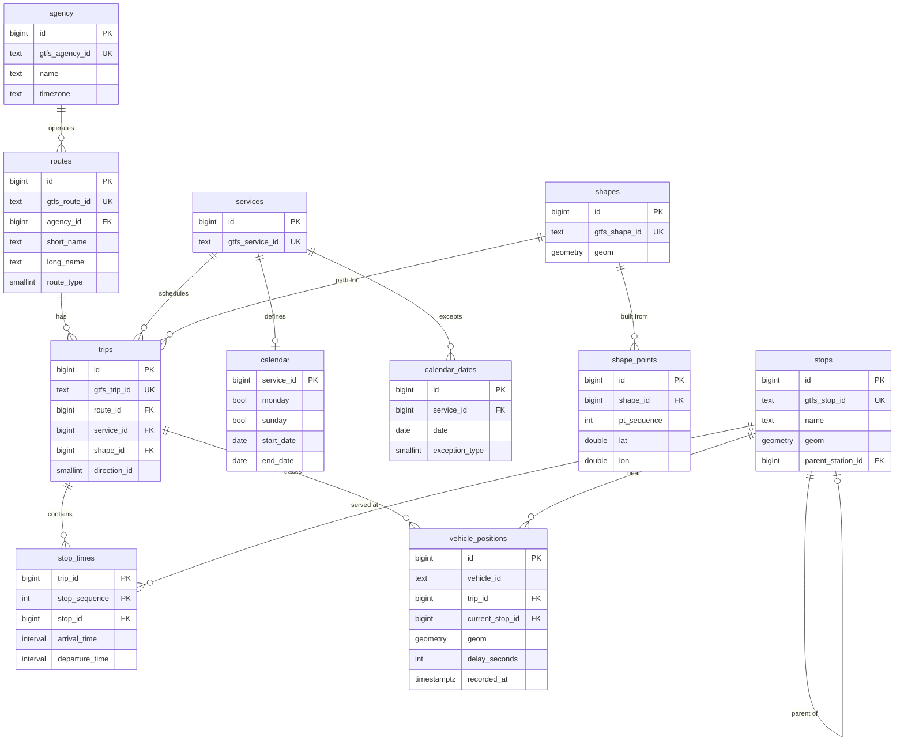

# CityBus - City Bus Transit System

[](https://github.com/zimbakovtech/citybus/actions/workflows/ci.yml)
[](backend/requirements.txt)
[](backend/app/main.py)
[](database/sql)
[](mobile/pubspec.yaml)
[](LICENSE)


Final project for the **Databases** course: a public-transport system built
around a **PostgreSQL 16 + PostGIS** database storing a GTFS-modeled bus
network, with a **FastAPI** backend (REST + WebSockets) and a **Flutter**
mobile app. The database is the core deliverable — relational modeling of the
GTFS domain, spatial data and queries, and graph-based route finding — the
backend and app exist to prove the data model works end to end.

The repo ships a synthetic but realistic GTFS feed for **Skopje** (5 bus
lines, 30 stops, weekday/weekend services, a holiday exception and an
after-midnight night trip), so everything runs fully offline.

## At a glance

| | |
|---|---|
| Database | PostgreSQL 16 + PostGIS 3.5 (Docker), `pg_trgm` for text search |
| Backend | FastAPI, SQLAlchemy 2 (async) + asyncpg, Alembic, Pydantic v2 |
| Mobile | Flutter — Riverpod 3, GoRouter, Dio, freezed, flutter_map (OSM) |
| Seed data | committed synthetic GTFS feed: 1 agency, 5 routes, 30 stops, 682 trips, 6 396 stop_times |
| Planner | Connection Scan Algorithm, transfer-aware, after-midnight-correct |
| Realtime | scheduled-position simulation → `vehicle_positions` + WebSocket broadcast |
| Tests | pytest suite against the seeded db · Flutter unit + widget tests · CI in [`.github/workflows/ci.yml`](.github/workflows/ci.yml) |

## Repository layout

```
database/   canonical SQL schema, indexes, seed GTFS feed (+ generator)
backend/    FastAPI app, importer, planner, realtime, tests
mobile/     Flutter app (feature-first: stops, routes, planner, live)
docs/       architecture, database design discussion, ERD source
```

## Architecture

```
 GTFS feed (.txt / .zip)                                 Flutter app
 database/seed/gtfs/                              stops · routes · planner · live map
        │                                                ▲          ▲
        │ import_gtfs.py                            REST /api/v1    │ WS /ws/realtime
        ▼                                                │          │
 PostgreSQL 16 + PostGIS  ◄── SQLAlchemy (async) ──  FastAPI backend
 GTFS schema · GiST/GIN indexes                   endpoints → services → repositories
 pg_trgm text search                              CSA planner · vehicle simulation
```

Details and the data-flow description: [docs/architecture.md](docs/architecture.md).

## The data model (the star of the show)

Full discussion in [docs/database.md](docs/database.md); canonical commented
DDL in [database/sql/](database/sql). The short version:

- **Grain** — `stop_times` is the finest-grained table: one row per
  (trip, stop) scheduled event. Everything else hangs off it.
- **Surrogate keys** — every table gets a `bigint IDENTITY` PK; the GTFS
  string ids are preserved as `UNIQUE` natural keys and resolved to surrogates
  at import time. Compact joins, feed-replacement safety.
- **`services` normalization** — GTFS `service_id` (referenced by `calendar`,
  `calendar_dates` and `trips`) becomes its own entity, supporting
  exception-only feeds.
- **`interval`, not `time`** — GTFS times exceed `24:00:00` for after-midnight
  service; `time` would corrupt them. The seed feed includes a `24:29:00`
  arrival to prove the point.
- **Derived shape geometry** — raw `shape_points` rows are assembled into one
  `LineString` per shape at import (`ST_MakeLine … ORDER BY pt_sequence`), so
  a map polyline is a single-row `ST_AsGeoJSON` fetch.
- **Indexing** — GiST on geometries (KNN + `ST_DWithin`), trigram GIN on
  searchable names, B-tree composites for the hot schedule lookups
  (`(stop_id, departure_time)`, `(trip_id, stop_sequence)`), B-tree on FKs.

### ERD



## Route planner

`GET /api/v1/planner` computes the **earliest-arrival** journey between two
stops (or coordinates snapped to the nearest stop via PostGIS KNN) with
transfers, using the **Connection Scan Algorithm (CSA)**:

1. A *connection* is one hop of one trip between consecutive stops — derived
   directly from `stop_times` with a `LEAD` window function, filtered to the
   services active on the query date (calendar + exceptions; yesterday's
   after-midnight trips are included with a −24 h shift).
2. Connections are scanned once in departure order, relaxing each one; a
   connection is usable if you are already on its trip, or you reach its
   departure stop in time (120 s minimum transfer buffer when changing
   vehicles; waiting at the origin is free).
3. Stops are labeled with *(arrival time, vehicles used)* compared
   lexicographically, so among equally fast journeys the one with fewer
   transfers wins — plain CSA can otherwise return a same-arrival journey
   with a pointless extra hop.
4. The predecessor chain is folded into ride legs (consecutive connections on
   one trip) separated by transfer legs.

Dijkstra or A* on a time-expanded graph would also work; CSA was chosen
because the connection array falls directly out of the `stop_times` table,
needs no priority queue, and is easy to explain. "No route found" is an
explicit `found: false` response, not an error. The algorithm is pure
(seconds + opaque ids, no I/O) and unit-tested on a hand-built fixture with
known answers ([test_planner_csa.py](backend/app/tests/test_planner_csa.py)).

## Realtime

GTFS-Realtime is simplified to a simulation: a background task (started with
the app, or standalone via `scripts/simulate_realtime.py`) finds every trip
under way at the current moment, interpolates each vehicle's position between
its two current stops from the schedule, applies a slowly-drifting random
delay, appends a row to `vehicle_positions`, and broadcasts the update to all
WebSocket clients. `WS /ws/realtime` sends a `snapshot` message on connect,
then `vehicle_position` updates roughly every 2 s; `GET /api/v1/live/vehicles`
serves the same latest-per-vehicle snapshot over REST (`DISTINCT ON` +
recency window).

## Running from scratch

Prerequisites: Docker, Python 3.11+, Flutter. On Apple Silicon the PostGIS
image runs via Rosetta emulation (pinned `platform: linux/amd64`).

```bash
# 1. database
docker compose up -d db

# 2. backend
cd backend
python -m venv .venv && source .venv/bin/activate
pip install -r requirements.txt
cp .env.example .env
alembic upgrade head
python scripts/import_gtfs.py            # loads database/seed/gtfs
uvicorn app.main:app --reload            # http://localhost:8000/docs

# 3. mobile (new terminal, device/emulator running)
cd mobile
flutter pub get
dart run build_runner build --delete-conflicting-outputs
flutter run --dart-define=API_BASE_URL=http://10.0.2.2:8000   # 10.0.2.2 = host from Android emulator
```

iOS simulator: use `--dart-define=API_BASE_URL=http://localhost:8000`.
Physical device: start the API with `--host 0.0.0.0` (the `make api` target
does) and use `http://<your-machine-LAN-IP>:8000`.
Or use the Makefile: `make up`, `make seed`, `make api`, `make test`.

> The app has no offline mode by design — if screens show
> "Could not reach the server", the backend isn't running (or isn't reachable
> from the device): check `docker ps` shows `citybus-db` healthy and that
> `make api` is running.

To import a real GTFS feed instead of the sample one, point `GTFS_ZIP_PATH`
in `backend/.env` at a `.zip` or a directory of `.txt` files and re-run the
importer (it truncates and reloads, so re-running is safe).

## API overview

Interactive docs at **http://localhost:8000/docs** once the backend runs.

| Endpoint | Purpose |
|---|---|
| `GET /api/v1/stops?search=` | trigram stop search (paginated) |
| `GET /api/v1/stops/nearby?lat=&lon=&radius_m=` | stops around a point, KNN-ordered, with distance |
| `GET /api/v1/stops/{id}` | stop detail + serving routes |
| `GET /api/v1/stops/{id}/departures?at=&window_min=` | upcoming departures (service calendars + after-midnight handled) |
| `GET /api/v1/routes?search=` | route search (paginated) |
| `GET /api/v1/routes/{id}` / `/stops` / `/shape` / `/trips` | detail, ordered stops, GeoJSON polyline, trips on a date |
| `GET /api/v1/trips/{id}` | trip with ordered stop_times |
| `GET /api/v1/planner?from_stop_id=&to_stop_id=&depart_at=` | CSA journey plan (also `from_lat`/`from_lon` etc.) |
| `GET /api/v1/live/vehicles` | latest simulated vehicle positions |
| `WS /ws/realtime` | snapshot + live vehicle updates |

## Testing

- `make test` / `cd backend && pytest` — API tests (search, nearby, ordered
  stops, departures incl. after-midnight + holiday), CSA unit fixture with
  known answers, planner API with a known origin→destination, GTFS time
  parsing, realtime tick + WebSocket. Requires the database up and seeded
  (`make seed`).
- `cd mobile && flutter test` — model (de)serialization (incl. the plan-leg
  union), provider tests with a fake repository, a planner-controller test
  and a widget test. `flutter analyze` is clean.
- CI ([.github/workflows/ci.yml](.github/workflows/ci.yml)) runs both suites
  on every push/PR: the backend job boots a PostGIS service container,
  migrates, imports the seed feed and runs lint + pytest; the mobile job runs
  build_runner, `flutter analyze` and `flutter test`.

## Screenshots

*(placeholder — add emulator screenshots of the four screens here)*

| Stops | Route map | Planner | Live |
|---|---|---|---|
| … | … | … | … |

## Notes

- Generated Dart code (`*.freezed.dart`, `*.g.dart`) **is committed**, so the
  app builds without running `build_runner` first (the command above is only
  needed after model changes).
- OpenStreetMap tiles are used directly for local development with the
  required attribution; a production app would need a proper tile provider
  (API key).
- Out of scope by design: authentication, accounts, payments, deployment —
  the focus is the database.

---

## License

This project is licensed under the MIT License. See the [LICENSE](LICENSE) file for details.

---

*Damjan Zimbakov & Filip Karamachoski - FINKI Databases Course*